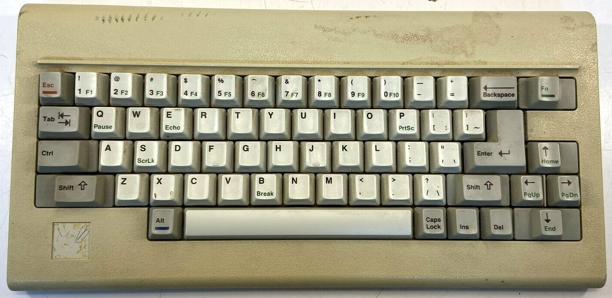

# agi.js
Adventure Game Interpreter (AGI) for Sierra's classic 80's adventure games written for the browser environment.

## Running

0. Run `yarn` within the project root folder.
1. Download any AGI game and extract its contents into a `game` folder within the project root folder.
2. Run `yarn play`
3. Open http://localhost:3000

## Controls

- Click on the red outline to start the game
- KB controls
    - `ENTER` to skip most title sequences
- Menus now work (virtual program controller keys are supported, (ex: 21 for "About" menu item)

## Background

This is a project that aims to recreate one of the most beautiful game engines ever created.
Sierra On-Line's Adventure Game Interpreter was created in the mid 80's by Sierra employees 
Jeff Stephenson and Chris Iden and quickly became the cornerstone on which many of Sierra's 
early titles would be based. AGI was built around the concept of a virtual machine that made 
it fairly easy for Sierra to port their games to multiple platforms.

The virtual machine was based around an in-house developed C-like programming language called "Logic".
When the programmer compiled a Logic file, the compiler produced an 8-bit "opcode" for each statement.
In the interpreter, each opcode was defined in a jump table which simply pointed to an assembler
subroutine. This made the system very fast and ridiculously elegant, because the logic itself never
needed to be recompiled no matter what the target platform was. It was also fairly easy to extend
the system which can be witnessed by the numerous versions of AGI interpreters produced by Sierra.

By the time these games were created, storage was limited and expensive. To reduce asset size,
the game's background images were defined as vector graphics instead of full raster images. 
When the game needed to display a new background image, it was drawn into a buffer and 
finally blitted to the screen. This is interesting because this theoretically allows us to rescale 
the images to any resolution. It's also interesting from an artistic perspective as it allows us to 
trace how the artist originally drawed the pictures, command by command. 

Another interesting feature of the engine was its ability render a room with a pseudo-perspective.
The engine divided the screen into 15 sections, called priority bands. This was basically a
kind of low-resolution Z-buffer. All background drawing commands were drawn both with a visual color
and a priority value, so everytime the engine had to draw an animated object, each of its pixels were
compared against the backgrounds pixel's priority value to decide if the pixel was to be drawn or not.
All control-lines and boundaries where the player could not go was also drawn into this priority buffer.

## AGI command references

- Open http://agi.sierrahelp.com/AGIStudioHelp/TOC.html and then run this to show all entries:
```
Array.from(document.querySelectorAll('dt')).forEach(v=>v.click())
```

- https://wiki.scummvm.org/index.php/AGI/Specifications/Resources#The_else_command_and_more_on_brackets
```
/usr/local/Cellar/qt/5.15.0/bin/qmake agistudio.pro -o Makefile
```

## Game Specific References

### SQ2
- https://www.youtube.com/watch?v=eVsF_FZ54O0
- http://sarien.net/spacequest2#outsidexos4
- http://www.sierrahelp.com/Misc/PointLists/SQ2Points.html

Progress: 
- Cannot leave 2nd room
- Cannot press F10 to leave first room communicator scene
  - F10 key not implemented

## AGI Architecture

- http://agiwiki.sierrahelp.com/images/f/f5/AGDS.pdf
- Main reference: http://www.agidev.com/articles/agispec/agispecs.html#toc10
- http://agiwiki.sierrahelp.com/index.php?title=Actions,_Tests_and_Flags_in_the_Adventure_Game_Interpreter#Flags

Logic command implementations from another engine
- https://github.com/huguesv/AgiPlayer/blob/ced9361b910e6ad391c86380c6e17c73ea01064f/src/Woohoo.Agi.Interpreter/Interpreter/AgiInterpreter.Kernel.cs
- https://github.com/huguesv/AgiPlayer/blob/ced9361b910e6ad391c86380c6e17c73ea01064f/src/Woohoo.Agi.Interpreter/Interpreter/AgiInterpreter.cs

- LOGICs are the AGI virtual machine code for the game, tells the engine what to do
    - Core aspect of the engine
- PICTURES are background images with visual (displayed as is to user) and priority images (act as primitive z-buffer for clipping and bounding of game objects)
- VIEWs are animations collections that sit on top of the PICs; e.g. ego, opening doors, portals, etc.
  - CELs are individual sequences of animations
  - LOOPs are individual frames within an animation sequence
- SOUNDs are just that, both sound effects along with music
- [WORDS.TOK](https://wiki.scummvm.org/index.php/AGIWiki/WORDS.TOK) contains words recognized by the game

## AGI details discovered

No support for F11, F12 keys since the AGI engine was made to target IBM PCjrs. Their keyboards only
have F1 - F10 keys.



## Use Emscripten to compile the logic code because JS does not support GOTOs

- https://emscripten.org/docs/getting_started/downloads.html
- https://github.com/emscripten-core/emscripten/issues/9036#issuecomment-532092743
  - `open /Applications/Python\ 3.8/Install\ Certificates.command`

## License

Licensed under the GPL version 3. 

This is in no way affiliated with or endorsed by Sierra Entertainment or any other company.
